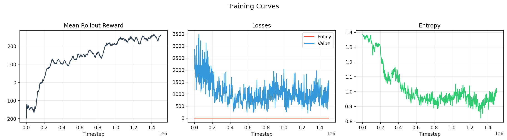
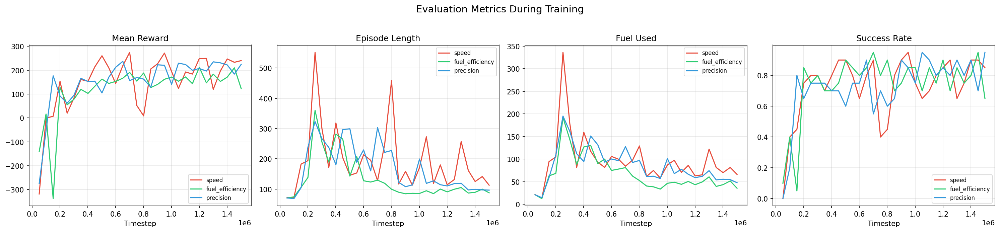
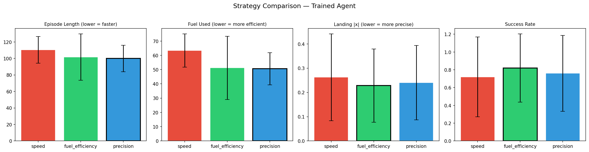

# Introduction
Rocket league is a very complex multiplayer game requiring a high level of individual skill, as well as team coordination and overall strategy/planning. Currently the best bots have mastered all of these aspects of the game. The one skill that bots lack is adaptability. They are trained with one strategy in mind and that is the strategy which they play always.

My belief is that it is possible to make a bot that can switch between multiple different strategies. Once we have a bot that is able to change strategy, we can add either a second network to choose the strategy, or use a human "coach" to update the strategy (or mix of strategies) that the bot uses in real time.

I think the way to make this happen is as follows:

## Stage 1 - General Training:
First, the bot needs to learn how to play the game. It needs to learn how to drive, jump, hit the ball, aerial, pass, etc. We can use commonly known methods/tricks in the RLGym community to shape the rewards in this stage to get the bot to a high level naturally. 

Once the bot can play the game on its own and has a decently high skill level in the game comes stage 2.

## Stage 2 - Strategy Training:

In this stage we train the different strategies of the bot. To do this we alter the architecture/algorithm as follows:

### Architecture

To make the bot behave differently with different strategies we append a normalized strategy input vector (perhaps one-hot encoded, or perhaps with float values to mix strategies together) to the observation layer, where the values correspond to the weight of that strategy.

### Rewards

To match the reward function to the strategy training, we feed in the normalized strategy input vector to the reward function and add the dot product of the vector and the rewards from our various different strategy evaluation functions.

As the strategy input vector affects both the observation layer and the reward function, we can train the different strategies in different ways. Either one a time, or mixing with random (or not) values.

# This Project

In this project we will aim to prove that this method of training works on a small scale proof of concept project using smaller, more efficient, popular gym environments in the machine learning community, before then applying this method to an actual Rocket League bot using the GigaLearn (https://github.com/ZealanL/GigaLearnCPP-Leak) framework by ZealanL using the PPO algorithm.

# Proof of Concept Results

## Introduction

To validate the strategy-conditioning approach before applying it to Rocket League, we ran a proof of concept using **LunarLander-v3** from [Gymnasium](https://gymnasium.farama.org/). LunarLander is a popular RL benchmark where an agent must land a spacecraft on a pad. It is simple enough to train in minutes but has enough nuance to support meaningfully different play-styles.

We defined three strategies that a single agent can switch between:

| # | Strategy | Behaviour goal |
|---|----------|----------------|
| 0 | **Speed** | Land as quickly as possible (heavy per-step penalty, light engine cost) |
| 1 | **Fuel Efficiency** | Minimise engine usage (heavy engine cost, light time penalty) |
| 2 | **Precision** | Land as close to the centre pad as possible (x-distance penalty, centre-landing bonus) |

## Methods

**Architecture** — A shared-backbone Actor-Critic MLP (2 hidden layers of 128 units, Tanh activations, orthogonal init). The observation input is the 8-dim LunarLander state concatenated with a 3-dim strategy vector (one-hot or mixed), giving an 11-dim input. Total parameters: 18,693.

**Reward** — Each timestep produces three separate reward signals (one per strategy), each with its own shaping, engine cost, time penalty, and terminal bonuses. The agent receives `dot(strategy_vector, [R_speed, R_fuel, R_precision])`, exactly as described in the project proposal.

**Training** — PPO with GAE, 16 vectorised environments, 128 steps per rollout. Each environment samples a random one-hot strategy on episode reset, so the agent is trained on all strategies simultaneously.

| Hyperparameter | Value |
|----------------|-------|
| Learning rate | 3e-4 |
| Gamma | 0.99 |
| GAE lambda | 0.95 |
| Clip epsilon | 0.2 |
| Value coef | 0.5 |
| Entropy coef | 0.01 |
| Minibatch size | 256 |
| PPO epochs | 4 |
| Total timesteps | 1,500,000 |
| Training time | ~351s (CPU) |

The code is fully vectorised with PyTorch and GPU-ready (auto-detects CUDA). All modules (`env_wrapper`, `networks`, `ppo`, `train`, `evaluate`) are self-contained and reusable.

## Results

### Training Curves

The agent learns to land successfully across all strategies, going from a mean rollout reward of -200 (crashing) to +250 (consistent landings) over 1.5M timesteps:



### Strategy Differentiation Over Training

Per-strategy evaluation was run every 50K steps. The "Fuel Used" panel is the clearest signal — the speed strategy (red) consistently burns more fuel than fuel_efficiency (green):



### Final Evaluation (50 episodes per strategy, greedy policy)

| Strategy | Mean Reward | Ep. Length | Fuel Used | Landing \|x\| | Success Rate |
|----------|-------------|------------|-----------|---------------|-------------|
| **Speed** | 193.7 | 110 | **63.4** | 0.263 | 72% |
| **Fuel Efficiency** | 169.1 | 102 | **51.2** | 0.228 | **82%** |
| **Precision** | 181.2 | **100** | 50.6 | **0.240** | 76% |



**Key observations:**
- The **speed** strategy uses ~24% more fuel than fuel efficiency, confirming it fires engines more aggressively to land faster.
- The **fuel efficiency** strategy achieves the highest success rate (82%) while using the least fuel (51.2), showing that conservative engine usage leads to more controlled landings.
- The **precision** strategy produces the shortest episodes and moderate fuel usage, balancing between speed and efficiency.
- All three strategies are produced by the **same network** — only the strategy input vector changes.

### Conclusion

The proof of concept confirms that **strategy-vector conditioning works**: a single neural network can learn distinct behaviours by appending a strategy vector to the observation and weighting reward signals with the same vector. This validates the core mechanism proposed for the Rocket League bot and gives us confidence to proceed with Stage 1 of Rocket League training.

# Stage 1: Rocket League — General Training

With the POC validated, Stage 1 trains a 1v1 Rocket League bot using the [GigaLearnCPP](https://github.com/ZealanL/GigaLearnCPP-Leak) framework with PPO. The strategy-conditioning architecture (`StrategyObsBuilder`, `StrategyReward`, `StrategyConfig`) is wired in from the start — Stage 1 uses a single "general" strategy while the bot learns fundamentals (driving, jumping, hitting the ball, aerials, scoring).

The bot trains with 32 parallel environments on GPU (CUDA), processing ~38,000 timesteps/second. The reward function emphasizes ball contact (strong touch + any touch rewards), approach (velocity toward ball), shooting (ball-to-goal velocity), and game events (goals, bumps, demos), following RLGym community best practices for early-stage training.

See [`rocket_league/README.md`](rocket_league/README.md) for full architecture details, reward weights, hyperparameters, and build instructions.

## Running the Proof of Concept

### Prerequisites

- Python 3.8+
- pip

### Setup

```bash
pip install -r requirements.txt
```

This installs PyTorch, Gymnasium with Box2D, NumPy, and Matplotlib. If you have a CUDA-capable GPU, install the CUDA version of PyTorch first for faster training (the code auto-detects GPU availability).

### Train

```bash
python -m proof_of_concept.train
```

Training runs for 1.5M timesteps (~6 minutes on CPU). Evaluation logs are printed every 50K steps. You can override defaults with flags:

```bash
python -m proof_of_concept.train --total_timesteps 500000 --n_envs 8
```

Outputs are saved to `results/poc/`:
- `logs/training.csv` — per-rollout metrics (reward, losses, entropy, FPS)
- `logs/evaluation.csv` — per-strategy eval metrics over training
- `checkpoints/model_final.pt` — trained model weights

### Evaluate

After training, generate the comparison table and plots:

```bash
python -m proof_of_concept.evaluate
```

This loads `results/poc/checkpoints/model_final.pt`, runs 50 greedy episodes per strategy, and saves plots to `results/poc/plots/`. To use a different checkpoint or episode count:

```bash
python -m proof_of_concept.evaluate --checkpoint path/to/model.pt --episodes 100
```